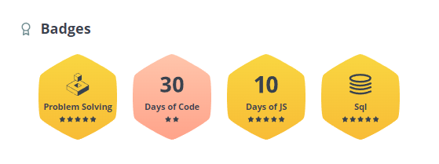
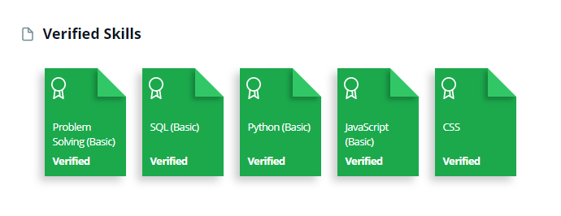

<h1 align="center">Hi, This is Suba Shree 🙋🏽</h1>
<b>I am a dedicated and versatile computer science engineer currently pursuing my MS in Computer Science at Indiana University Bloomington, driven by a passion for crafting efficient and scalable applications that deliver exceptional value. Prior to my academic journey, I gained two years of industry experience as a software engineer where I honed my ability to transform complex challenges into elegant solutions. I hold a Bachelor's in Computer Science and Engineering from Anna University, India, where I built a robust foundation in algorithms, data structures, and machine learning. I am a firm believer in the power of hands-on projects to bridge theory and practice, thriving on practical experience to deepen my understanding. Throughout my journey, I have explored various facets of computer science - including UI design, backend development, database management, machine learning, and data analytics - because why limit myself to just one area of expertise when I can collect them all like Pokémon?<b>
  

<h3>Profile Visits 👀</h3>

 
 

<h3 align="left">Connect with me 🤝</h3>

 &nbsp;&nbsp;
 
  &nbsp;&nbsp;
  &nbsp;&nbsp;

  
<h3><a href="https://www.hackerrank.com/subashree18171?hr_r=1">HackerRank Verified Skills and Badges</a></h3>
 

 
  

<h2>GitHub Stats 📈</h2>

 
  

